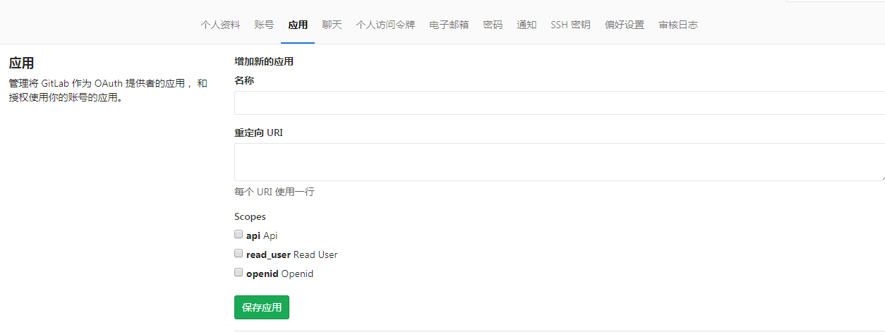
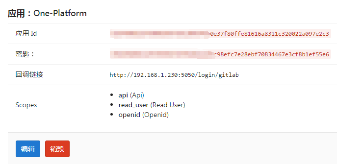
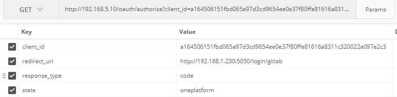
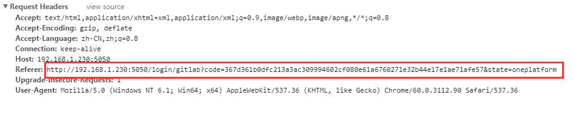
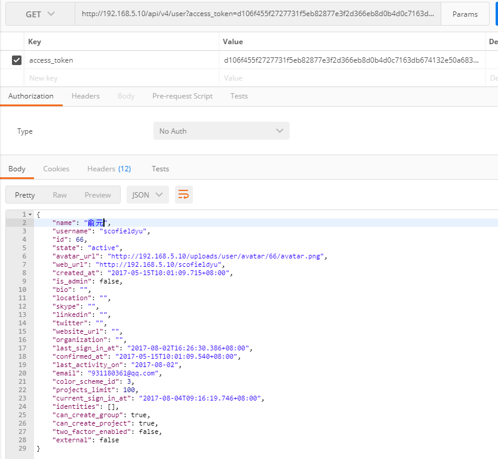

GitLab as an OAuth2 provider
----------------------------

- **在gitlab个人资料设置-应用，增加新的应用，即可生成application ID 和secret**

 

 

## 授权码模式获取access_token

- **GET请求: gitlab地址/oauth/authorize ,参数如下图(可再加上scope参数,例如只需要获取用户信息，但没有api权限，则scope=read_user)：**

- **登录gitlab后，需要确认认证**

- **确认认证后，gitlab会生成code作为参数，回调到redirect_uri**

- **根据code再去请求获取acces_token**

---

##  密码模式获取access_token

---

## 得到access_token后请求gitlab api获取相关信息

- **例：获取当前用户信息**

