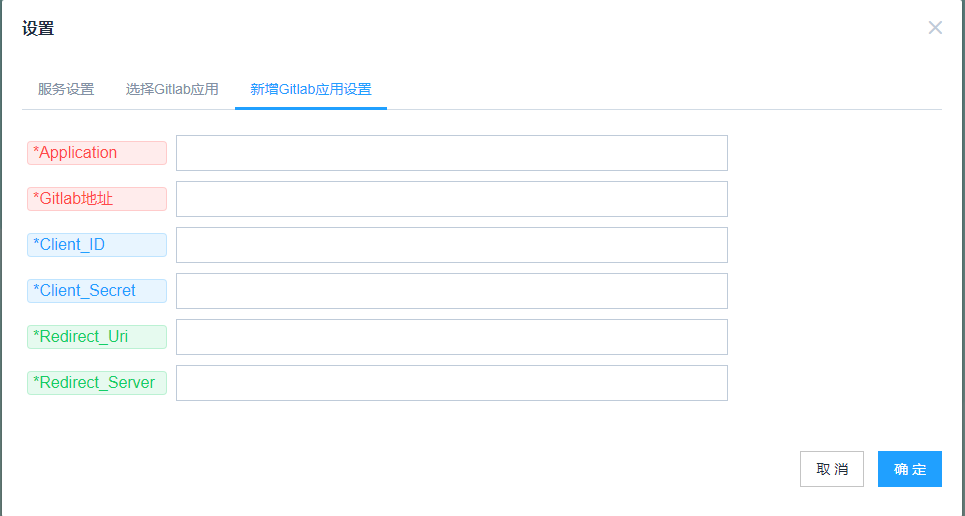

# <center>One-Platform</center>

- 安装依赖：pip install -r requirements.txt

- 本机调试运行：python run.py

- 运行后，localhost  为登录页面

- linux上部署：

 > gunicorn -c gun.conf run:app

- 打包docker镜像(在Dockfile文件路径下)：

 > docker build -t smart_tools .

 > docker run -d -p 8000:80 smart_tools

- 在根目录下有docker-compose配置文件，可以根据命令启动或者停止容器运行：

> docker-compose up -d --build       (启动)

> docker-compose down               （停止）


---

## 数据库迁移升级：

 - 使用flask-migrate和flask-script实现。

 - 修改数据库模型时，可以运行以下语句升级数据库：
   ```python
   python manage.py  db  migrate
   python manage.py  db  upgrade
   ```

 - 使用 python  manage.py  init_db 则会清空所有数据重新建表。

---

## gitlab多应用设置

考虑到在更换gitlab地址或者应用ID和密钥的情况下，需要重新打包编译前端代码的麻烦，在此可以通过配置来选择。

- 运行服务后，在此设计了一个配置页面：localhost/#/login/debug ，然后右上角齿轮按钮弹出设置框。

- 如下图可以增加一个应用，包括gitlab地址，应用ID和密钥，回调链接和回调服务。（应用名称应唯一，如果系统中存在，则更新该应用信息。）



- 配置正确的gitlab应用，保证你可以正常通过gitlab验证登录。

  - 点击查询，可以显示系统当前使用的gitlab应用，下拉显示所有gitlab应用列表。


 ---

 ## 系统效果图

 

 ## 使用gitlab登录
 